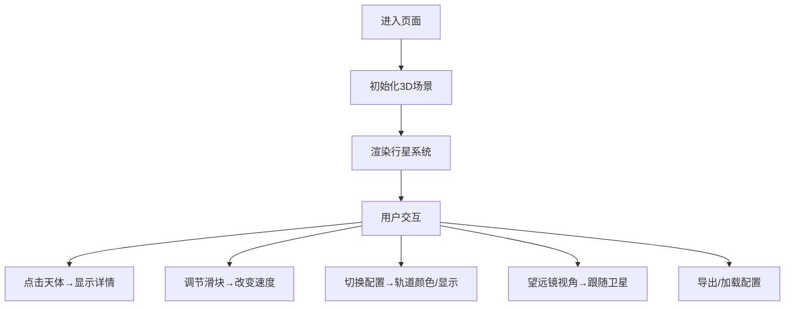

## 1. 产品概述

一个基于Three.js的交互式3D外行星系统模拟器，展示气态巨行星及其卫星系统的可视化效果，支持用户自定义配置和导出。
- 主要用途：天文教育、科学可视化、交互式演示
- 目标用户：天文爱好者、教育工作者、学生

## 2. 核心功能

### 2.1 功能模块
1. **3D场景主视图**: 气态巨行星、卫星系统、行星环、星空背景
2. **控制面板**: 公转速度调节、卫星轨道配置、望远镜视角切换
3. **信息面板**: 天体详细信息展示
4. **配置管理**: JSON参数导入导出

### 2.2 页面详情
| 页面名称 | 模块名称 | 功能描述 |
|-----------|-------------|---------------------|
| 主页面 | 3D场景渲染 | 气态行星带条纹纹理、多个卫星公转、土星环、星空粒子背景 |
| 主页面 | 全局控制 | 公转速度滑块、背景旋转开关、望远镜视角切换 |
| 主页面 | 卫星配置 | 每个卫星的轨道颜色选择、轨道线显示开关 |
| 主页面 | 信息面板 | 点击天体显示名称、半径、公转周期 |
| 主页面 | 配置管理 | 导出JSON配置、加载外部配置文件 |

## 3. 核心流程

用户进入页面后，3D场景自动渲染行星系统。用户可通过鼠标拖拽旋转视角、滚轮缩放，点击天体查看详情，使用控制面板调整参数，或导出/加载配置文件。

## 4. 用户界面设计

### 4.1 设计风格
- **主色调**: 深空蓝(#0a0a1a) + 星空紫(#1a1a3a) + 青色点缀(#00ffff)
- **布局**: 全屏3D画布 + 右侧半透明控制面板
- **字体**: Orbitron(标题) + JetBrains Mono(数据)
- **风格**: 科幻未来主义、半透明玻璃态UI、霓虹边框

### 4.2 页面设计概述
| 页面名称 | 模块名称 | UI元素 |
|-----------|-------------|-------------|
| 主页面 | 3D画布 | 全屏渲染、鼠标交互、平滑动画 |
| 主页面 | 控制面板 | 玻璃态卡片、滑块控件、颜色选择器、开关按钮 |
| 主页面 | 信息面板 | 浮动卡片、数据展示、关闭按钮 |
| 主页面 | 配置区域 | 文件上传、下载按钮、JSON预览 |

### 4.3 响应性
- 桌面端优先设计
- 控制面板可折叠适配小屏
- 触控设备支持手势操作

### 4.4 3D场景指导
- **环境**: 深空黑色背景 + 5000+星空粒子
- **光照**: 环境光 + 方向光模拟恒星照射
- **相机**: 轨道控制器默认视角，支持望远镜视角自动跟随
- **材质**: 行星使用Canvas生成条纹纹理，卫星使用纯色材质，光环使用半透明环形纹理
- **动画**: 卫星平滑公转，背景缓慢旋转，行星自转动画
