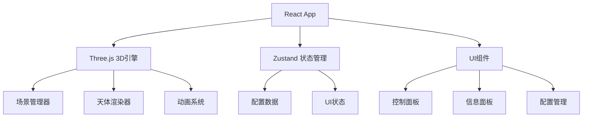

## 1. 架构设计



## 2. 技术描述

- **前端框架**: React@18 + TypeScript
- **构建工具**: Vite@5
- **样式方案**: TailwindCSS@3
- **3D引擎**: Three.js + @react-three/fiber + @react-three/drei
- **状态管理**: Zustand
- **包管理器**: npm

## 3. 数据模型

### 3.1 天体数据结构

```typescript
interface CelestialBody {
  id: string;
  name: string;
  type: 'planet' | 'moon';
  radius: number;
  color: string;
  orbitRadius?: number;
  orbitSpeed?: number;
  orbitTilt?: number;
  orbitColor?: string;
  showOrbit?: boolean;
  rotationSpeed?: number;
}

interface PlanetSystemConfig {
  planet: CelestialBody;
  moons: CelestialBody[];
  globalSpeedMultiplier: number;
  backgroundRotationSpeed: number;
  starCount: number;
}
```

## 4. 目录结构

```
src/
├── components/
│   ├── Scene/
│   │   ├── Planet.tsx
│   │   ├── Moon.tsx
│   │   ├── PlanetRing.tsx
│   │   └── StarField.tsx
│   ├── UI/
│   │   ├── ControlPanel.tsx
│   │   ├── InfoPanel.tsx
│   │   ├── MoonConfigItem.tsx
│   │   └── ConfigManager.tsx
│   └── App.tsx
├── store/
│   └── usePlanetStore.ts
├── utils/
│   ├── textureGenerator.ts
│   └── configUtils.ts
├── types/
│   └── index.ts
└── main.tsx
```

## 5. 核心组件说明

### 5.1 3D场景组件
- **Planet**: 气态行星渲染，Canvas生成条纹纹理，自转动画
- **Moon**: 卫星渲染，公转动画，轨道线显示
- **PlanetRing**: 土星环效果，半透明环形纹理
- **StarField**: 星空粒子系统，支持缓慢旋转

### 5.2 UI组件
- **ControlPanel**: 全局控制面板，速度滑块，视角切换
- **InfoPanel**: 天体信息展示面板
- **ConfigManager**: JSON配置导入导出功能

### 5.3 状态管理
- **usePlanetStore**: 管理系统配置、选中天体、运行状态

## 6. 关键技术点

1. **动态纹理生成**: 使用Canvas API生成气态行星条纹纹理
2. **轨道计算**: 使用三角函数计算卫星公转位置
3. **相机控制**: OrbitControls + 自定义跟随相机
4. **射线拾取**: Raycaster实现点击天体交互
5. **JSON序列化**: 配置参数的导入导出
