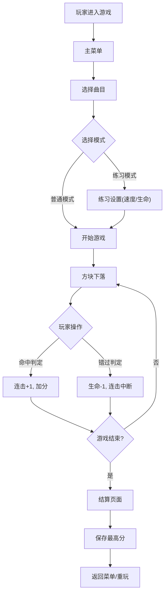

## 1. 产品概述

钢琴块游戏是一款基于节奏的音乐游戏，玩家需要在黑色方块到达判定线时准确点击或按键。游戏支持多种难度、自定义键位、MIDI导入和本地最高分记录。

- 核心目的：提供沉浸式的音乐节奏游戏体验
- 目标用户：音乐游戏爱好者、休闲玩家

## 2. 核心功能

### 2.1 用户角色
| 角色 | 注册方式 | 核心权限 |
|------|----------|----------|
| 玩家 | 无需注册 | 游戏游玩、设置自定义、本地存档 |

### 2.2 功能模块
1. **主菜单页面**: 游戏标题、开始游戏、曲目选择、设置、练习模式
2. **游戏页面**: 多轨道游戏区域、分数显示、连击显示、生命值
3. **结算页面**: 评分等级、分数统计、最高分、重新开始
4. **设置页面**: 键位自定义、难度选择、音量调节

### 2.3 页面详情
| 页面名称 | 模块名称 | 功能描述 |
|-----------|-------------|---------------------|
| 主菜单 | 标题区域 | 游戏标题、动态背景动画 |
| 主菜单 | 曲目列表 | 显示可用曲目、难度标识、最高分 |
| 主菜单 | 功能按钮 | 开始游戏、练习模式、设置入口 |
| 游戏页面 | 轨道区域 | 4-6条轨道、下落方块、判定线特效 |
| 游戏页面 | HUD界面 | 实时分数、连击数、生命值、进度条 |
| 游戏页面 | 暂停菜单 | 暂停、继续、退出游戏 |
| 结算页面 | 评分展示 | S/A/B/C等级动画、详细分数统计 |
| 结算页面 | 操作按钮 | 重新开始、返回菜单、下一首 |
| 设置页面 | 键位设置 | 可视化键位映射、自定义按键 |
| 设置页面 | 难度设置 | 简单/普通/困难/专家难度选择 |
| 设置页面 | 音量设置 | 音乐/音效音量滑块 |

## 3. 核心流程

## 4. 用户界面设计

### 4.1 设计风格
- **主色调**: 深色背景 (#0a0a0f) + 霓虹蓝 (#00d4ff) 高亮
- **辅助色**: 紫色 (#9333ea)、粉色 (#ec4899)、绿色 (#10b981)
- **按钮风格**: 玻璃拟态效果、圆角、悬浮发光
- **字体**: 标题使用 Orbitron（科技感），正文使用 Noto Sans SC
- **布局风格**: 居中对称、深色主题、霓虹发光效果
- **视觉风格**: 赛博朋克/电子音乐风格

### 4.2 页面设计概述
| 页面名称 | 模块名称 | UI 元素 |
|-----------|-------------|-------------|
| 主菜单 | 标题区域 | 发光文字动画、粒子背景、频谱可视化 |
| 主菜单 | 曲目卡片 | 渐变边框、难度徽章、最高分标签 |
| 游戏页面 | 轨道区域 | 发光轨道线、脉冲判定线、方块拖尾效果 |
| 游戏页面 | HUD | 霓虹数字、连击火焰特效、生命值心形 |
| 结算页面 | 评分展示 | 等级徽章旋转入场、分数数字滚动 |
| 设置页面 | 键位设置 | 键盘可视化、按键高亮、拖拽重映射 |

### 4.3 响应式
- 桌面端优先：横向布局，6轨道全屏显示
- 移动端适配：纵向布局，4轨道触控优化
- 触控支持：大点击区域，触觉反馈

### 4.4 视觉特效
- 方块命中时：粒子爆炸效果、轨道闪光
- 连击累计：数字逐渐变大、颜色渐变（白→蓝→紫→金）
- 失误时：屏幕红色闪烁、震动效果
- 背景：动态频谱波形随音乐跳动
