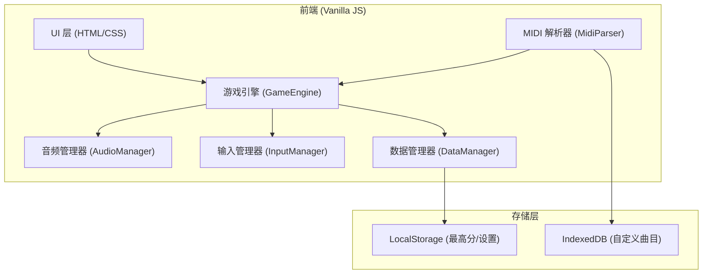

## 1. 架构设计



## 2. 技术描述

- **前端**: 原生 HTML5 + CSS3 + JavaScript (ES6+)
- **构建工具**: 无构建工具，直接运行
- **音频**: Web Audio API + HTML5 Audio
- **动画**: CSS Animations + requestAnimationFrame
- **存储**: LocalStorage + IndexedDB
- **MIDI 解析**: 简化版 MIDI 文件解析器 (仅解析 Note On 事件)

## 3. 文件结构

| 文件路径 | 用途 |
|----------|------|
| `/index.html` | 主入口文件，包含所有页面结构 |
| `/css/style.css` | 全局样式、主题变量、动画 |
| `/js/GameEngine.js` | 核心游戏引擎、游戏循环、碰撞检测 |
| `/js/AudioManager.js` | 音频播放、音效管理、音量控制 |
| `/js/InputManager.js` | 键盘输入、触摸输入、键位映射 |
| `/js/DataManager.js` | 本地存储、最高分、设置管理 |
| `/js/MidiParser.js` | MIDI 文件解析、曲目生成 |
| `/js/Tracks.js` | 预设曲目数据 |
| `/js/main.js` | 应用入口、页面路由、初始化 |
| `/assets/sounds/` | 音效文件 (hit, miss, combo) |
| `/assets/music/` | 背景音乐文件 |

## 4. 核心数据结构

### 4.1 曲目数据结构
```javascript
{
  id: string,
  name: string,
  artist: string,
  difficulty: 'easy' | 'normal' | 'hard' | 'expert',
  bpm: number,
  duration: number,
  notes: [
    { time: number, lane: number, type: 'normal' | 'hold' }
  ],
  musicUrl: string
}
```

### 4.2 游戏状态
```javascript
{
  score: number,
  combo: number,
  maxCombo: number,
  lives: number,
  perfect: number,
  good: number,
  miss: number,
  isPaused: boolean,
  isPracticeMode: boolean,
  speedMultiplier: number
}
```

### 4.3 设置数据
```javascript
{
  keyMapping: { '0': 'd', '1': 'f', '2': 'j', '3': 'k' },
  difficulty: 'normal',
  musicVolume: 0.7,
  sfxVolume: 0.5,
  laneCount: 4
}
```

## 5. 核心算法

### 5.1 游戏循环
- 使用 `requestAnimationFrame` 实现 60fps 游戏循环
- 基于时间差 (deltaTime) 计算方块位置，确保不同帧率下速度一致

### 5.2 判定算法
```
判定窗口:
- Perfect: ±50ms → 100分 × 连击倍率
- Good: ±100ms → 50分 × 连击倍率
- Miss: > ±100ms → 0分, 连击中断
```

### 5.3 评分系统
```
准确率 = (Perfect×100 + Good×50) / (总音符×100)
S: 准确率 ≥ 95%
A: 准确率 ≥ 85%
B: 准确率 ≥ 70%
C: 准确率 < 70%
```

### 5.4 MIDI 解析 (简化版)
- 读取 MIDI 文件二进制数据
- 解析轨道中的 Note On 事件 (velocity > 0)
- 根据音高映射到轨道 (mod 轨道数)
- 根据时间戳转换为游戏时间
