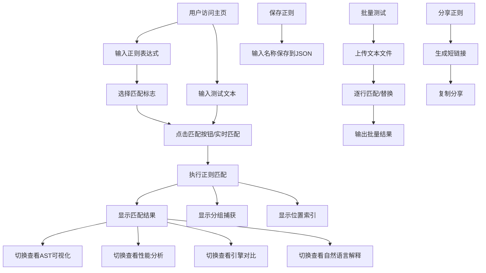

## 1. 产品概述

在线正则表达式测试与调试工具，帮助开发者快速验证、调试和学习正则表达式。通过可视化界面提供匹配结果、分组捕获、位置索引、AST结构可视化、性能分析等功能，支持多引擎对比和自然语言解释。

### 目标用户
- 开发者和程序员
- 学习正则表达式的学生
- 需要处理文本数据的数据分析师

### 产品价值
- 提供一站式正则表达式调试环境
- 降低正则表达式学习和使用门槛
- 通过可视化和性能分析帮助写出更高效的正则

---

## 2. 核心功能

### 2.1 用户角色
| 角色 | 注册方式 | 核心权限 |
|------|----------|----------|
| 普通用户 | 无需注册 | 使用所有功能，保存正则到本地 |

### 2.2 功能模块
1. **正则匹配测试**：输入正则和测试文本，实时显示匹配结果
2. **AST可视化**：展示正则表达式的抽象语法树结构
3. **保存与加载**：保存常用正则到本地JSON，支持快速加载
4. **批量测试**：上传文本文件，逐行应用正则
5. **性能分析**：检测回溯问题，给出优化建议
6. **多引擎对比**：同时测试Python re和regex库
7. **自然语言解释**：将正则模式翻译成易懂的描述
8. **分享功能**：生成带参数的短链接分享正则

### 2.3 页面详情
| 页面名称 | 模块名称 | 功能描述 |
|----------|----------|----------|
| 主页 | 正则输入区 | 正则表达式输入框、标志位选择（re.IGNORECASE等） |
| 主页 | 测试文本区 | 多行文本输入框，支持粘贴测试文本 |
| 主页 | 匹配结果区 | 显示匹配项、分组内容、位置索引，高亮显示匹配 |
| 主页 | AST可视化区 | 树形或图形展示正则语法结构 |
| 主页 | 性能分析区 | 显示执行时间、回溯警告、优化建议 |
| 主页 | 引擎对比区 | 并排显示re和regex库的匹配结果差异 |
| 主页 | 解释说明区 | 正则各部分的自然语言解释 |
| 主页 | 保存管理区 | 命名保存正则、加载已保存的正则 |
| 主页 | 批量测试区 | 文件上传、批量匹配/替换结果展示 |
| 主页 | 分享功能区 | 生成短链接、一键复制 |

---

## 3. 核心流程

### 3.1 主要用户流程
1. 用户打开网站，进入正则测试主界面
2. 输入正则表达式和测试文本，选择匹配标志
3. 系统实时执行匹配，展示结果、分组、位置
4. 用户可切换查看AST结构、性能分析、引擎对比
5. 满意的正则可命名保存到本地
6. 可上传文件进行批量测试
7. 可生成短链接分享给他人

### 3.2 流程图

---

## 4. 用户界面设计

### 4.1 设计风格
- **主色调**：深蓝色 (#1e3a5f) 作为主色，科技感十足
- **辅助色**：亮青色 (#00d4ff) 用于高亮和强调
- **背景**：深色主题 (#0f172a)，减少眼睛疲劳，适合代码类工具
- **按钮风格**：圆角矩形，带有微妙的阴影和悬停动画
- **字体**：JetBrains Mono 作为代码字体，Inter 作为界面字体
- **布局**：左右分栏布局，左侧输入区，右侧结果区
- **图标**：使用简洁的线性图标，配合微妙的动画效果

### 4.2 页面设计概览
| 页面名称 | 模块名称 | UI元素 |
|----------|----------|--------|
| 主页 | 头部导航 | Logo、功能标签切换、主题切换 |
| 主页 | 正则输入区 | 带行号的代码编辑器、标志位复选框组、快捷插入按钮 |
| 主页 | 测试文本区 | 多行文本编辑器、字符计数、清空按钮 |
| 主页 | 结果展示区 | Tab切换（匹配结果/AST/性能/对比/解释）、可折叠面板 |
| 主页 | 匹配结果 | 高亮匹配文本、分组表格、位置信息 |
| 主页 | AST可视化 | 树形结构展示、节点可展开/收起、颜色区分节点类型 |
| 主页 | 保存管理 | 模态框展示保存列表、搜索过滤、删除操作 |
| 主页 | 批量测试 | 文件拖拽上传、进度条、结果导出 |

### 4.3 响应式设计
- **桌面端**：左右两栏布局，左侧40%输入区，右侧60%结果区
- **平板端**：上下布局，输入区在上，结果区在下
- **移动端**：单列布局，Tab切换输入和结果
- **触摸优化**：增大按钮点击区域，支持滑动切换Tab

### 4.4 交互动效
- 页面加载：渐入动画，元素依次出现
- 匹配结果：高亮闪烁动画提示新匹配
- Tab切换：平滑过渡动画
- 按钮悬停：背景色渐变+轻微放大
- AST节点：展开/收起的平滑过渡
- 错误提示：抖动动画+红色边框
