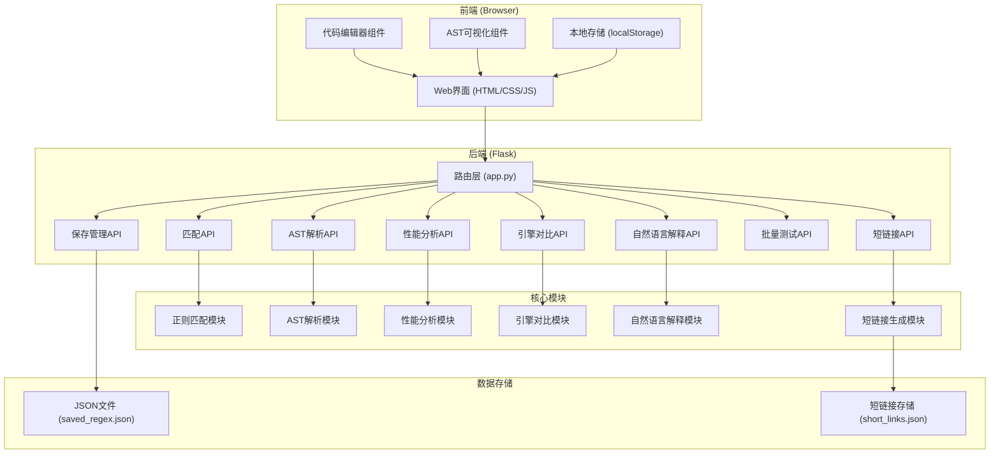
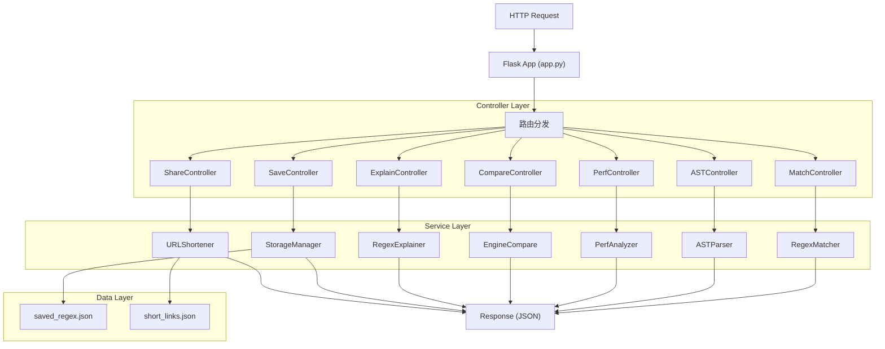
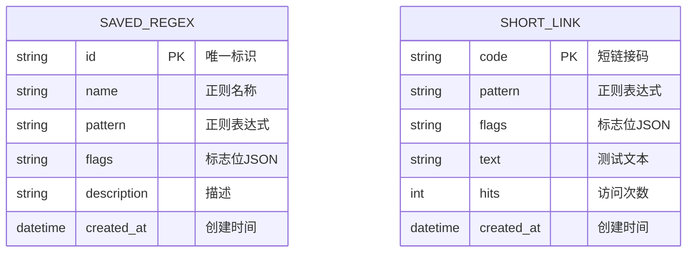

## 1. 架构设计



## 2. 技术描述

### 2.1 技术栈
- **前端**：原生 HTML5 + CSS3 + JavaScript (ES6+)
- **后端**：Flask 3.x + Python 3.10+
- **代码编辑器**：CodeMirror 6 (轻量级代码编辑器)
- **AST可视化**：基于SVG的自定义树形渲染
- **正则引擎**：Python标准库 `re` + 第三方库 `regex`
- **数据存储**：本地JSON文件（无需数据库）

### 2.2 项目结构
```
/
├── app.py                    # Flask主应用，路由定义
├── requirements.txt          # Python依赖
├── saved_regex.json          # 保存的正则表达式
├── short_links.json          # 短链接映射
├── core/
│   ├── __init__.py
│   ├── matcher.py            # 正则匹配核心逻辑
│   ├── ast_parser.py         # AST解析与可视化
│   ├── performance.py        # 性能分析与回溯检测
│   ├── engine_compare.py     # 多引擎对比
│   ├── explainer.py          # 自然语言解释
│   ├── shortener.py          # 短链接生成
│   └── storage.py            # JSON文件存储
├── static/
│   ├── css/
│   │   └── style.css         # 主样式文件
│   └── js/
│       └── app.js            # 前端主逻辑
└── templates/
    └── index.html            # 主页面模板
```

### 2.3 初始化方式
```bash
pip install -r requirements.txt
python app.py
```

## 3. 路由定义

| 路由 | 方法 | 用途 |
|------|------|------|
| `/` | GET | 主页，加载Web界面 |
| `/api/match` | POST | 执行正则匹配，返回结果 |
| `/api/ast` | POST | 解析正则表达式，返回AST结构 |
| `/api/performance` | POST | 性能分析，检测回溯问题 |
| `/api/compare` | POST | 对比re和regex引擎结果 |
| `/api/explain` | POST | 生成正则的自然语言解释 |
| `/api/save` | POST | 保存正则到本地JSON |
| `/api/saved` | GET | 获取已保存的正则列表 |
| `/api/saved/<id>` | DELETE | 删除已保存的正则 |
| `/api/batch` | POST | 批量测试上传的文本文件 |
| `/api/shorten` | POST | 生成短链接 |
| `/s/<code>` | GET | 短链接重定向 |

## 4. API 定义

### 4.1 匹配请求
```typescript
interface MatchRequest {
    pattern: string;
    text: string;
    flags: {
        IGNORECASE: boolean;
        MULTILINE: boolean;
        DOTALL: boolean;
        UNICODE: boolean;
        VERBOSE: boolean;
    };
}

interface MatchResult {
    success: boolean;
    error?: string;
    matches: Array<{
        match: string;
        start: number;
        end: number;
        groups: string[];
        groupDict: Record<string, string>;
    }>;
    count: number;
}
```

### 4.2 AST响应
```typescript
interface ASTNode {
    type: string;
    value?: string;
    children?: ASTNode[];
    start?: number;
    end?: number;
}

interface ASTResponse {
    success: boolean;
    error?: string;
    ast: ASTNode;
}
```

### 4.3 性能分析响应
```typescript
interface PerformanceResult {
    success: boolean;
    executionTime: number;
    steps: number;
    backtrackingRisk: 'low' | 'medium' | 'high';
    warnings: string[];
    suggestions: string[];
}
```

## 5. 服务器架构



## 6. 数据模型

### 6.1 数据模型定义


### 6.2 JSON文件格式

**saved_regex.json:**
```json
{
  "patterns": [
    {
      "id": "uuid-1",
      "name": "邮箱验证",
      "pattern": "^[a-zA-Z0-9._%+-]+@[a-zA-Z0-9.-]+\\.[a-zA-Z]{2,}$",
      "flags": {"IGNORECASE": true},
      "description": "标准邮箱格式验证",
      "created_at": "2024-01-01T00:00:00"
    }
  ]
}
```

**short_links.json:**
```json
{
  "links": {
    "abc123": {
      "pattern": "\\d+",
      "flags": {},
      "text": "测试文本123",
      "hits": 5,
      "created_at": "2024-01-01T00:00:00"
    }
  }
}
```
