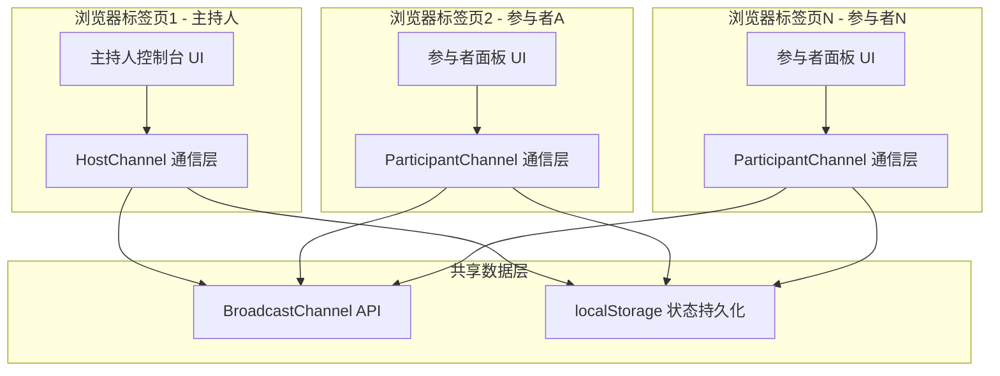
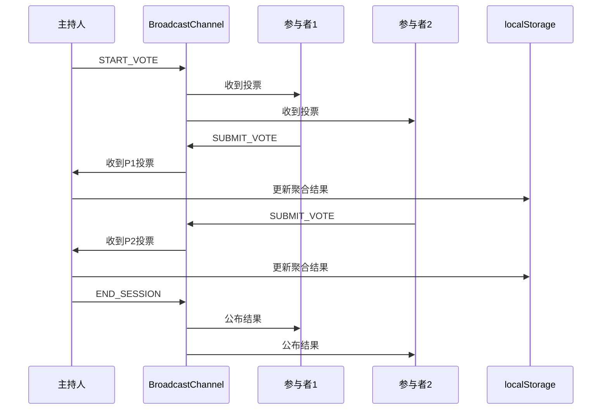

## 1. 架构设计



## 2. 技术说明

- **前端框架**：原生 HTML5 + CSS3 + JavaScript (ES6+)
- **构建工具**：无，直接浏览器运行
- **通信机制**：BroadcastChannel API（同浏览器多标签页实时通信）
- **状态持久化**：localStorage（房间状态、投票数据持久化，支持页面刷新恢复）
- **数据可视化**：Canvas 自绘柱状图 + Canvas 自绘词云
- **后端/数据库**：无

### 2.1 通信协议设计

通过 BroadcastChannel 传递 JSON 消息，消息格式：

```typescript
interface ChannelMessage {
  type: MessageType;
  roomCode: string;
  payload: any;
  senderId: string;
  timestamp: number;
}

type MessageType =
  | "CREATE_ROOM"
  | "JOIN_ROOM"
  | "LEAVE_ROOM"
  | "KICK_PARTICIPANT"
  | "START_VOTE"
  | "SUBMIT_VOTE"
  | "START_QUESTION"
  | "SUBMIT_ANSWER"
  | "START_RUSH"
  | "RUSH_ANSWER"
  | "END_SESSION"
  | "LOCK_VOTE"
  | "UNLOCK_VOTE"
  | "RESET_ROOM"
  | "SYNC_STATE"
  | "PARTICIPANT_LIST_UPDATE"
```

### 2.2 状态模型

```typescript
interface RoomState {
  roomCode: string;
  hostId: string;
  participants: Participant[];
  currentSession: VoteSession | QuestionSession | RushSession | null;
  isLocked: boolean;
  createdAt: number;
}

interface Participant {
  id: string;
  nickname: string;
  joinedAt: number;
}

interface VoteSession {
  type: "vote";
  question: string;
  options: string[];
  multiSelect: boolean;
  duration: number; // 秒，0表示无倒计时
  startedAt: number;
  responses: Record<string, string[]>; // participantId -> selected option indices
  isFinished: boolean;
}

interface QuestionSession {
  type: "question";
  question: string;
  startedAt: number;
  responses: Record<string, string>; // participantId -> answer text
  isFinished: boolean;
}

interface RushSession {
  type: "rush";
  question: string;
  startedAt: number;
  winner: string | null; // participantId
  isFinished: boolean;
}
```

## 3. 文件结构

| 文件路径 | 用途 |
|----------|------|
| index.html | 主入口HTML文件，包含所有页面结构 |
| styles.css | 全局样式、组件样式、动画、响应式 |
| app.js | 主应用逻辑、状态管理、页面路由 |
| channel.js | BroadcastChannel 通信层封装 |
| charts.js | 柱状图和词云Canvas绘制 |
| wordcloud.js | 词云布局算法 |

## 4. 数据流



## 5. 关键技术实现

### 5.1 BroadcastChannel 通信
- 每个标签页创建独立的 BroadcastChannel 实例
- 消息带有 senderId 防止自回声
- 房间码作为频道名的一部分，避免不同房间消息交叉

### 5.2 状态同步
- 主持人端作为"权威状态源"，所有状态变更由主持人确认
- 参与者加入时，主持人广播完整房间状态（SYNC_STATE）
- 使用 localStorage 存储房间状态，支持页面刷新后恢复

### 5.3 倒计时机制
- 主持人端维护精确倒计时
- 通过定时广播倒计时同步给参与者
- 倒计时归零自动触发结束投票

### 5.4 抢答判定
- 参与者发送 RUSH_ANSWER 消息
- 主持人按 timestamp 排序，最先到达者获胜
- 网络延迟在本地 BroadcastChannel 场景下可忽略

### 5.5 柱状图渲染
- 使用 Canvas 2D API 自绘
- 支持动画过渡（从0增长到目标值）
- 颜色映射到各选项

### 5.6 词云渲染
- 自实现简化词云算法：螺旋布局
- 按词频排序，高频词居中且字号更大
- Canvas 绘制，支持动画浮现
