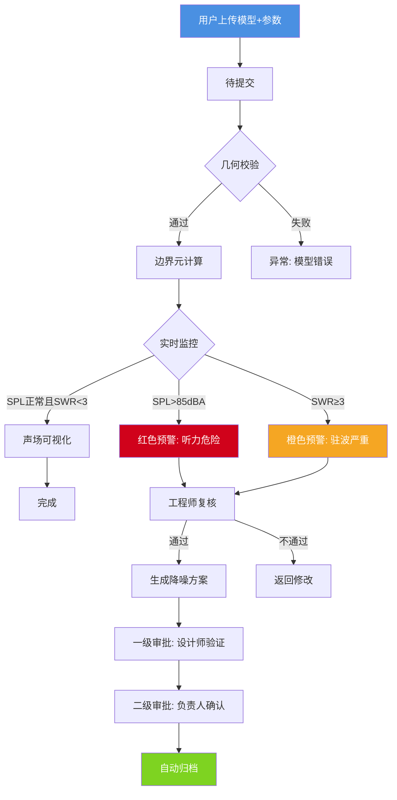
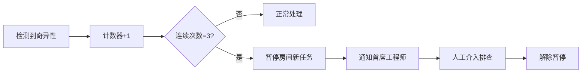

# 高精度室内声场模拟与自适应降噪决策平台 - 产品需求文档 (PRD)

## 1. 产品概述

专业级室内声学工程平台，集成边界元法(BEM)计算引擎、实时声场监控、智能降噪方案生成与多级审批工作流。面向声学工程师、设计师及施工团队，提供从房间建模到施工指导的全流程数字化解决方案。

**核心价值**：将传统需数周的声场模拟缩短至小时级，通过自动化预警机制确保声学安全，AI驱动材料优选降低30%以上试错成本。

## 2. 核心功能

### 2.1 用户角色

| 角色 | 权限范围 | 核心职责 |
|------|----------|----------|
| 声学工程师 | 任务提交、参数配置、实时监控、预警复核 | 几何校验、BEM计算执行、异常诊断 |
| 声学设计师 | 一级审批、方案优化 | 验证模拟结果合理性、调整材料参数 |
| 项目负责人 | 二级审批、归档确认 | 最终质量把控、项目进度管理 |
| 施工团队 | 方案查看、数据导出 | 获取施工图纸和材料清单 |
| 首席工程师 | 系统级异常处理、策略配置 | 处理连续奇异性、设定安全阈值 |

### 2.2 功能模块

1. **任务管理中心**：文件上传、状态流转、批量操作
2. **声场模拟引擎**：BEM建模、脉冲响应(RIR)计算、混响时间(RT60)、声压级(SPL)分布
3. **实时监控看板**：声场均匀度、驻波比(SWR)、安全阈值监测
4. **预警响应系统**：多级预警规则、自动推送、复核流程
5. **智能降噪方案**：吸音材料布局、扬声器阵列参数、成本估算
6. **报告生成系统**：等声级线图、混响衰减曲线、雷达图评估、PDF导出
7. **数据管理模块**：历史查询、多维筛选、原始数据下载
8. **智能推荐引擎**：基于历史数据的材料组合推荐、坐标优化
9. **审批工作流**：两级电子签核、自动归档、版本控制
10. **性能统计面板**：完成率分析、响应时间追踪、达标率可视化

### 2.3 页面功能详情

| 页面名称 | 模块名称 | 功能描述 |
|-----------|-------------|------------------|
| 仪表盘首页 | 综合概览 | 今日任务数、进行中任务、预警统计、性能指标卡片、快捷操作入口 |
| 任务列表页 | 任务管理 | 表格视图/卡片视图切换、状态筛选(待提交/几何校验/BEM计算/可视化/完成/异常)、搜索排序、批量提交 |
| 新建任务页 | 文件上传 | 房间CAD/SKP模型拖拽上传、声源参数表单(频率20Hz-20kHz、声功率级50-120dB)、房间用途选择 |
| 计算详情页 | 状态流转 | 六态流程图实时更新、当前阶段高亮显示、预计剩余时间、日志输出窗口 |
| 声场可视化页 | 3D渲染 | Three.js房间模型、SPL热力图叠加、等声级线动态绘制、视角切换(俯视/侧视/漫游) |
| 监控面板页 | 实时数据 | 声场均匀度仪表盘(目标>85%)、驻波比折线图(SWR<3阈值线)、SPL柱状图(听力安全85dBA) |
| 预警中心页 | 事件管理 | 预警列表(红/橙/黄三级)、时间轴视图、复核对话框、处理记录 |
| 降噪方案页 | AI建议 | 材料推荐卡片(玻璃棉/岩棉/聚酯纤维)、2D平面布置图、扬声器坐标表格、总成本计算 |
| 审批流程页 | 电子签核 | 待办事项列表、对比查看(前后版本差异)、审批意见输入框、通过/退回按钮 |
| 报告中心页 | 文档管理 | PDF预览、模板选择(标准/详细/简版)、按房间用途/日期筛选、批量导出 |
| 数据分析页 | 历史洞察 | 趋势图表(月度完成率)、散点图(预警vs达标率)、帕累托图(常见异常类型) |
| 推荐引擎页 | 智能匹配 | 相似房间案例库、材料效果对比、一键应用推荐方案 |

## 3. 核心业务流程

### 3.1 主流程：从任务提交到归档

### 3.2 异常处理流程

### 3.3 预警分级机制

| 级别 | 触发条件 | 推送对象 | 响应时限 |
|------|----------|----------|----------|
| 🔴 红色 | SPL > 85 dBA 或 SWR > 5 | 声学工程师 + 首席工程师 | 15分钟内 |
| 🟠 橙色 | 3 ≤ SWR ≤ 5 或 SPL > 80 dBA | 声学工程师 | 30分钟内 |
| 🟡 黄色 | 均匀度 < 80% 或 RT60偏差 > 0.3s | 声学工程师 | 1小时内 |

## 4. 用户界面设计

### 4.1 设计风格定位

**美学方向**：**工业科技风 (Industrial-Tech)** - 结合精密仪器感与现代数据可视化的冷峻专业美学

#### 视觉特征：
- **主色调**：深海蓝 (#0A1929) + 科技青 (#00D4FF) + 警示红 (#FF3366)
- **辅助色**：石墨灰 (#2D3748) + 数据绿 (#00C853) + 警告橙 (#FF9800)
- **字体系统**：
  - 标题字体：`JetBrains Mono` (等宽技术感)
  - 正文字体：`IBM Plex Sans` (清晰易读)
  - 数据字体：`Roboto Mono` (数值展示)
- **按钮风格**：微圆角(4px)、渐变边框发光、悬停时扫描线动画
- **布局风格**：左侧固定导航 + 右侧内容区、卡片式模块、网格化仪表盘
- **图标风格**：线性图标 + 发光描边、状态指示灯(呼吸灯效果)

#### 特色元素：
- **背景纹理**：细微网格线 + 动态粒子噪声(模拟声波传播)
- **数据可视化**：热力图使用光谱色谱、雷达图半透明填充、波形图实时滚动
- **微交互**：数字跳动计数器、进度条流体填充、状态切换滑入动画
- **3D场景**：暗调环境 + 边缘光照明、材质反射率0.3-0.6、后处理泛光效果

### 4.2 页面UI规范

| 页面名称 | 核心组件 | 布局特点 | 配色方案 | 特效要求 |
|-----------|----------|----------|----------|----------|
| 仪表盘 | KPI卡片组 | 4列网格 + 底部图表区 | 渐变背景卡 | 数字滚动动画 |
| 任务列表 | 数据表格 | 全宽表格 + 顶部工具栏 | 斑马纹行 | 行悬停高亮 |
| 新建任务 | 分步表单 | 左右分栏(预览区) | 深色输入框 | 文件拖拽反馈 |
| 计算详情 | 流程图 + 日志 | 上部流程 + 下部终端 | 时间轴样式 | 实时日志流 |
| 声场可视化 | 3D画布 + 图例 | 全屏Canvas + 浮动控件 | 热力色谱 | 鼠标交互提示 |
| 监控面板 | 仪表盘 + 图表 | 2x2网格布局 | 阈值颜色编码 | 数值闪烁警告 |
| 预警中心 | 列表 + 时间轴 | 左侧列表右侧详情 | 级别色彩标签 | 未读脉冲动画 |
| 降噪方案 | 卡片 + 平面图 | 上下堆叠 | 材料质感配色 | 悬停放大效果 |
| 审批流程 | 对话框 + 差异对比 | 居中模态框 | 蓝白简洁 | 签名动画 |
| 报告中心 | 缩略图 + 操作栏 | 瀑布流布局 | 文件类型图标 | 预览加载动画 |
| 数据分析 | 多图表组合 | Tab切换 + 自适应图表 | 数据系列配色 | 图表联动高亮 |
| 推荐引擎 | 案例卡片 + 对比表 | 左侧筛选右侧结果 | 置信度色阶 | 匹配度环形图 |

### 4.3 响应式设计策略

- **桌面端优先** (≥1440px)：完整功能展示，三栏布局可用
- **平板适配** (768px-1439px)：双栏折叠导航，触摸优化控件
- **移动端** (<768px)：单栏垂直流，底部Tab导航，简化图表展示

### 4.4 3D声场可视化规格

- **环境设置**：深空背景(#000510) + 微弱星点粒子
- **光照方案**：三点布光(主光暖白6000K + 补光冷蓝 + 轮廓光青色)
- **相机控制**：OrbitControls限制俯仰角(-89°~89°)，缩放距离2m-50m
- **模型表现**：房间线框模式 + 半透明表面(透明度0.7)，声源用发光球体标识
- **交互功能**：点击墙面显示该面SPL值，滚轮缩放细节，右键平移视角
- **后处理**：UnrealBloomPass(强度0.8,半径0.4) + SSAO(环境光遮蔽)
- **性能预算**：面数<100k，FPS稳定≥30，内存占用<500MB

## 5. 关键业务规则

### 5.1 任务状态机约束

- **不可逆流转**：完成→异常 需首席工程师授权
- **超时自动升级**：某状态停留>24h → 自动标记为异常并通知上级
- **并行限制**：同一房间最多2个任务同时处于计算阶段

### 5.2 安全阈值硬性规定

- **听力安全线**：任何测点SPL不得超过85 dBA(8小时暴露标准)
- **驻波警戒线**：SWR > 3 时必须介入处理
- **均匀度底线**：空间SPL差异≤±6dB视为合格

### 5.3 审批时效要求

- 一级审批(设计师)：收到后4小时内响应
- 二级审批(负责人)：收到后8小时内响应
- 超时自动提醒：每2小时推送一次直至处理

### 5.4 数据保留策略

- 原始脉冲响应数据：永久保存(用于后续机器学习训练)
- 中间计算缓存：保留90天后自动清理
- 已归档任务报告：至少保存5年(符合工程档案规范)

## 6. 性能与可靠性指标

| 指标项 | 目标值 | 说明 |
|--------|--------|------|
| 单任务BEM计算时长 | < 2小时 (中等复杂度房间) | 1000个节点以内模型 |
| 并发任务支持 | ≥ 10个同时计算 | 依赖后端集群规模 |
| 预警推送延迟 | < 5秒 | 从检测到送达 |
| 页面加载时间 | < 3秒 | 首屏内容渲染 |
| 数据可视化FPS | ≥ 25 | 3D场景流畅度 |
| 系统可用性 | 99.5% | 月度统计 |
