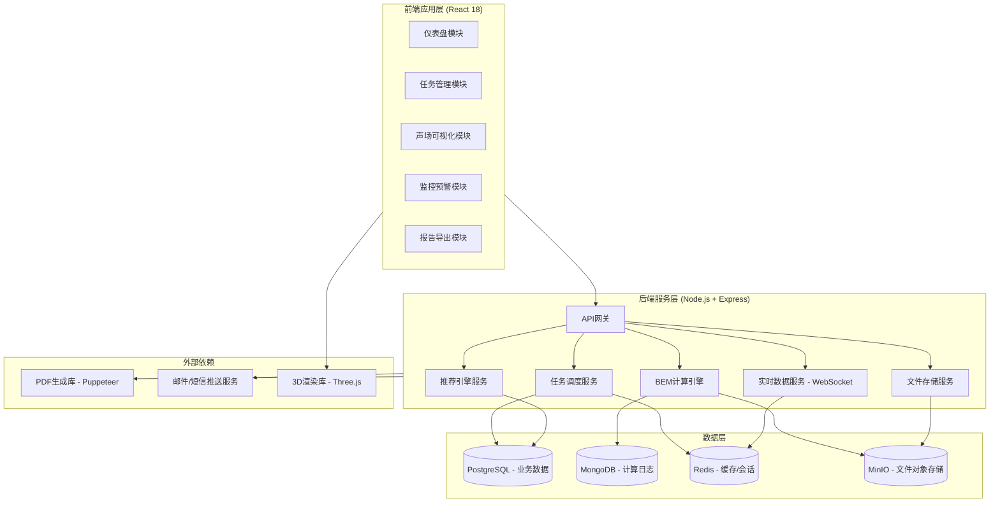
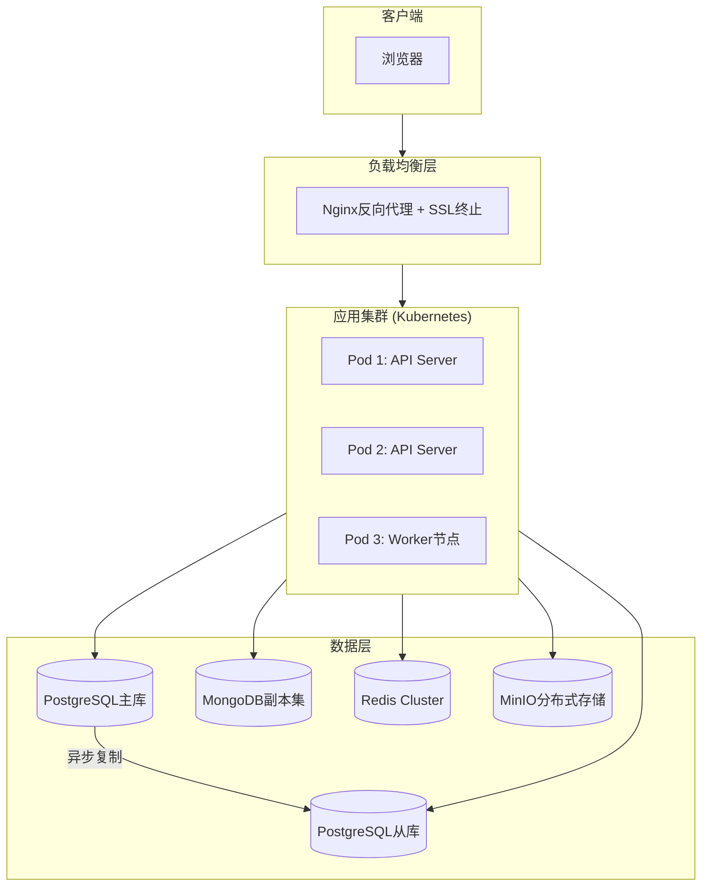

# 高精度室内声场模拟与自适应降噪决策平台 - 技术架构文档

## 1. 系统架构设计

### 1.1 整体架构图



### 1.2 技术栈选型理由

| 层级 | 技术选择 | 版本 | 选型依据 |
|------|----------|------|----------|
| **前端框架** | React | 18.2 | 生态成熟、3D集成友好、状态管理灵活 |
| **构建工具** | Vite | 4.5 | 极速HMR、原生ESM、优化生产包体积 |
| **UI框架** | Tailwind CSS | 3.3 | 原子化CSS、高度可定制、工业风实现便捷 |
| **3D引擎** | Three.js + @react-three/fiber | 0.15+ | Web端3D标准方案、React声明式集成 |
| **图表库** | Recharts + D3.js | 2.8 / 7.8 | React兼容性好 + 底层自定义能力强 |
| **后端运行时** | Node.js | 18 LTS | JavaScript全栈统一、异步I/O适合计算密集任务 |
| **Web框架** | Express | 4.18 | 轻量稳定、中间件丰富 |
| **关系数据库** | PostgreSQL | 15 | 复杂查询支持优秀、JSON字段灵活、空间数据扩展 |
| **文档数据库** | MongoDB | 6.0 | 日志数据结构多变、写入性能高 |
| **缓存** | Redis | 7.0 | 实时数据推送Pub/Sub、会话管理、任务队列 |
| **对象存储** | MinIO | 最新版 | S3兼容、私有化部署、大文件分片上传 |
| **进程队列** | Bull | 4.10 | 基于Redis、支持优先级、延迟任务、重试机制 |

## 2. 项目目录结构

```
acoustic-simulation-platform/
├── public/
│   ├── models/                    # 示例房间模型文件
│   └── fonts/                     # 自定义字体文件
├── src/
│   ├── frontend/                  # React前端应用
│   │   ├── components/            # 可复用组件
│   │   │   ├── common/            # 通用组件(按钮、输入框、模态框)
│   │   │   ├── layout/            # 布局组件(导航栏、侧边栏)
│   │   │   ├── charts/            # 图表组件(仪表盘、折线图、雷达图)
│   │   │   ├── three/             # Three.js场景组件
│   │   │   ├── forms/             # 表单组件(任务创建、审批)
│   │   │   └── tables/            # 表格组件(任务列表、数据表)
│   │   ├── pages/                 # 页面级组件
│   │   │   ├── Dashboard/         # 仪表盘首页
│   │   │   ├── TaskList/          # 任务列表页
│   │   │   ├── CreateTask/        # 新建任务页
│   │   │   ├── CalculationDetail/ # 计算详情页
│   │   │   ├── Visualization/     # 声场可视化页
│   │   │   ├── Monitoring/        # 监控面板页
│   │   │   ├── AlertCenter/       # 预警中心页
│   │   │   ├── NoiseReduction/    # 降噪方案页
│   │   │   ├── Approval/          # 审批流程页
│   │   │   ├── ReportCenter/      # 报告中心页
│   │   │   ├── Analytics/         # 数据分析页
│   │   │   └── Recommendation/    # 推荐引擎页
│   │   ├── hooks/                 # 自定义Hooks
│   │   ├── stores/                # Zustand状态管理
│   │   ├── utils/                 # 工具函数
│   │   ├── styles/                # 全局样式和Tailwind配置
│   │   ├── types/                 # TypeScript类型定义
│   │   ├── App.tsx                # 应用入口
│   │   └── main.tsx               # 渲染入口
│   ├── backend/                   # Node.js后端服务
│   │   ├── config/                # 配置文件
│   │   ├── controllers/           # 控制器层
│   │   ├── services/              # 业务逻辑层
│   │   │   ├── taskService.ts     # 任务管理服务
│   │   │   ├── bemService.ts      # BEM计算服务
│   │   │   ├── monitoringService.ts # 实时监控服务
│   │   │   ├── alertService.ts    # 预警服务
│   │   │   ├── reportService.ts   # 报告生成服务
│   │   │   ├── recommendationService.ts # 推荐引擎服务
│   │   │   └── approvalService.ts # 审批流程服务
│   │   ├── models/                # 数据模型(Mongoose/Sequelize)
│   │   ├── routes/                # API路由定义
│   │   ├── middleware/            # 中间件(认证、日志、限流)
│   │   ├── workers/               # 后台任务处理器(Bull Queue)
│   │   ├── utils/                 # 后端工具函数
│   │   └── app.ts                 # Express应用入口
│   └── shared/                    # 前后端共享代码
│       ├── constants/             # 常量定义
│       ├── types/                 # 共享类型
│       └── validations/           # 数据校验规则
├── .trae/documents/                # 项目文档
├── package.json                   # 根package.json
├── vite.config.ts                 # Vite配置
├── tailwind.config.js             # Tailwind配置
├── tsconfig.json                  # TypeScript配置
└── README.md                      # 项目说明
```

## 3. 路由定义

### 3.1 前端路由 (React Router v6)

| 路由路径 | 页面组件 | 权限要求 |
|----------|----------|----------|
| `/` | DashboardPage | 所有用户 |
| `/tasks` | TaskListPage | 所有用户 |
| `/tasks/new` | CreateTaskPage | 工程师+设计师 |
| `/tasks/:id` | CalculationDetailPage | 相关人员 |
| `/tasks/:id/visualization` | VisualizationPage | 相关人员 |
| `/monitoring` | MonitoringPage | 工程师及以上 |
| `/alerts` | AlertCenterPage | 工程师及以上 |
| `/tasks/:id/solution` | NoiseReductionPage | 设计师及以上 |
| `/approvals` | ApprovalPage | 设计师+负责人 |
| `/reports` | ReportCenterPage | 所有用户 |
| `/analytics` | AnalyticsPage | 负责人+首席工程师 |
| `/recommendations` | RecommendationPage | 设计师及以上 |

### 3.2 后端API路由 (RESTful)

| HTTP方法 | API路径 | 功能描述 | 认证方式 |
|----------|---------|----------|----------|
| POST | `/api/tasks` | 创建新模拟任务 | JWT Token |
| GET | `/api/tasks` | 获取任务列表(支持分页筛选) | JWT Token |
| GET | `/api/tasks/:id` | 获取任务详情 | JWT Token |
| PUT | `/api/tasks/:id/status` | 更新任务状态 | JWT Token + 角色权限 |
| POST | `/api/tasks/:id/files` | 上传模型/参数文件 | JWT Token + multipart/form-data |
| GET | `/api/tasks/:id/progress` | 获取计算实时进度(Server-Sent Events) | JWT Token |
| GET | `/api/tasks/:id/results` | 获取计算结果数据(RIR/SPL/RT60) | JWT Token |
| POST | `/api/alerts/:id/review` | 提交预警复核结果 | JWT Token |
| GET | `/api/recommendations/rooms/:roomId` | 获取房间材料推荐 | JWT Token |
| POST | `/api/approvals/:taskId/level1` | 一级审批(设计师) | JWT Token + 设计师角色 |
| POST | `/api/approvals/:taskId/level2` | 二级审批(负责人) | JWT Token + 负责人角色 |
| GET | `/api/reports` | 获取报告列表 | JWT Token |
| POST | `/api/reports/generate` | 触发PDF报告生成 | JWT Token |
| GET | `/api/reports/:id/download` | 下载报告PDF | JWT Token |
| GET | `/api/analytics/dashboard` | 性能看板统计数据 | JWT Token + 管理员角色 |
| WebSocket | `/ws/monitoring` | 实时声场数据推送 | JWT Token (握手阶段) |

## 4. 核心数据模型

### 4.1 ER关系图

```mermaid
erDiagram
    USER ||--o{ TASK : creates
    USER ||--o{ APPROVAL : reviews
    USER ||--o{ ALERT : handles
    ROOM ||--o{ TASK : contains
    TASK ||--|| CALCULATION_RESULT : produces
    TASK ||--o{ ALERT : triggers
    TASK ||--|| NOISE_SOLUTION : generates
    TASK ||--|| REPORT : outputs
    ALERT }o--| USER : assigned_to
    APPROVAL }o--| TASK : targets
    RECOMMENDATION }o--o ROOM : suggests_for

    USER {
        string id PK
        string username
        email
        role enum
        created_at timestamp
    }
    
    TASK {
        string id PK
        room_id FK
        creator_id FK
        status enum
        source_params JSONB
        current_stage text
        progress_percent int
        started_at timestamp
        completed_at timestamp
    }
    
    ROOM {
        string id PK
        name
        geometry_type enum
        dimensions JSONB
        purpose_category text
        singular_count int
        is_suspended boolean
    }
    
    CALCULATION_RESULT {
        string id PK
        task_id FK
        rir_data bytea
        rt60_values float8[]
        spl_distribution JSONB
        uniformity_score float
        standing_wave_ratio float
        max_spl_decibel float
        calculation_time_sec int
    }
    
    ALERT {
        string id PK
        task_id FK
        level enum
        alert_type text
        threshold_value float
        actual_value float
        status enum
        reviewer_id FK
        reviewed_at timestamp
    }
    
    NOISE_SOLUTION {
        string id PK
        task_id FK
        materials JSONB
        speaker_array JSONB
        estimated_cost decimal
        effectiveness_prediction float
    }
    
    APPROVAL {
        string id PK
        task_id FK
        approver_id FK
        level int
        decision enum
        comment text
        approved_at timestamp
    }
    
    REPORT {
        string id PK
        task_id FK
        file_path text
        template_type enum
        file_size_bytes int
        generated_at timestamp
    }

    RECOMMENDATION {
        string id PK
        room_id FK
        material_combination JSONB
        confidence_score float
        based_on_tasks UUID[]
    }
```

### 4.2 关键表DDL (PostgreSQL)

```sql
-- 用户表
CREATE TABLE users (
    id UUID PRIMARY KEY DEFAULT gen_random_uuid(),
    username VARCHAR(50) UNIQUE NOT NULL,
    email VARCHAR(255) UNIQUE NOT NULL,
    password_hash VARCHAR(255) NOT NULL,
    role VARCHAR(20) NOT NULL CHECK (role IN ('engineer', 'designer', 'manager', 'constructor', 'chief')),
    is_active BOOLEAN DEFAULT true,
    created_at TIMESTAMP WITH TIME ZONE DEFAULT NOW(),
    updated_at TIMESTAMP WITH TIME ZONE DEFAULT NOW()
);

-- 房间信息表
CREATE TABLE rooms (
    id UUID PRIMARY KEY DEFAULT gen_random_uuid(),
    name VARCHAR(200) NOT NULL,
    geometry_file_path TEXT,
    dimensions JSONB NOT NULL, -- {"length": 10.0, "width": 8.0, "height": 3.5}
    volume_m3 FLOAT NOT NULL,
    surface_area_m2 FLOAT NOT NULL,
    purpose_category VARCHAR(50), -- 'concert_hall', 'studio', 'office', etc.
    singular_count INTEGER DEFAULT 0,
    is_suspended BOOLEAN DEFAULT false,
    suspended_reason TEXT,
    created_by UUID REFERENCES users(id),
    created_at TIMESTAMP WITH TIME ZONE DEFAULT NOW()
);

-- 模拟任务表
CREATE TABLE tasks (
    id UUID PRIMARY KEY DEFAULT gen_random_uuid(),
    room_id UUID NOT NULL REFERENCES rooms(id),
    creator_id UUID NOT NULL REFERENCES users(id),
    status VARCHAR(30) NOT NULL DEFAULT 'pending' CHECK (
        status IN ('pending', 'geometry_check', 'bem_calculation', 'visualization', 'completed', 'abnormal')
    ),
    source_parameters JSONB NOT NULL, -- {"frequency_hz": 1000, "sound_power_level_db": 90}
    current_stage VARCHAR(100),
    progress_percent INTEGER DEFAULT 0 CHECK (progress_percent >= 0 AND progress_percent <= 100),
    error_message TEXT,
    started_at TIMESTAMP WITH TIME ZONE,
    completed_at TIMESTAMP WITH TIME ZONE,
    created_at TIMESTAMP WITH TIME ZONE DEFAULT NOW(),
    updated_at TIMESTAMP WITH TIME ZONE DEFAULT NOW()
);

-- 计算结果表
CREATE TABLE calculation_results (
    id UUID PRIMARY KEY DEFAULT gen_random_uuid(),
    task_id UUID NOT NULL UNIQUE REFERENCES tasks(id),
    rir_data BYTEA, -- 脉冲响应原始数据(二进制)
    rt60_values FLOAT8[], -- 各频段混响时间 [0.63, 0.72, ...]
    spl_distribution JSONB, -- 声压级分布网格数据
    uniformity_score FLOAT CHECK (uniformity_score >= 0 AND uniformity_score <= 1),
    standing_wave_ratio FLOAT, -- 驻波比
    max_spl_decibel FLOAT, -- 最大声压级
    avg_spl_decibel FLOAT, -- 平均声压级
    calculation_time_sec INTEGER, -- 计算耗时(秒)
    node_count INTEGER, -- BEM网格节点数
    computed_at TIMESTAMP WITH TIME ZONE DEFAULT NOW()
);

-- 预警记录表
CREATE TABLE alerts (
    id UUID PRIMARY KEY DEFAULT gen_random_uuid(),
    task_id UUID NOT NULL REFERENCES tasks(id),
    alert_level VARCHAR(10) NOT NULL CHECK (alert_level IN ('red', 'orange', 'yellow')),
    alert_type VARCHAR(50) NOT NULL, -- 'spl_exceeded', 'swr_high', 'uniformity_low'
    threshold_value FLOAT NOT NULL,
    actual_value FLOAT NOT NULL,
    status VARCHAR(20) DEFAULT 'pending' CHECK (status IN ('pending', 'reviewing', 'resolved', 'dismissed')),
    reviewer_id UUID REFERENCES users(id),
    review_comment TEXT,
    reviewed_at TIMESTAMP WITH TIME ZONE,
    response_time_sec INTEGER, -- 响应时长(秒)
    triggered_at TIMESTAMP WITH TIME ZONE DEFAULT NOW()
);

-- 创建索引以提升查询性能
CREATE INDEX idx_tasks_room_status ON tasks(room_id, status);
CREATE INDEX idx_tasks_creator_created ON tasks(creator_id, created_at DESC);
CREATE INDEX idx_alerts_level_status ON alerts(alert_level, status);
CREATE INDEX idx_alerts_task_triggered ON alerts(task_id, triggered_at DESC);
CREATE INDEX idx_rooms_purpose ON rooms(purpose_category);
```

## 5. API接口详细定义

### 5.1 任务相关接口

```typescript
// types/api/task.ts

interface CreateTaskRequest {
  roomId: string;
  sourceParameters: {
    frequencyHz: number; // 20-20000
    soundPowerLevelDb: number; // 50-120
    sourceType: 'point' | 'line' | 'surface';
    sourcePosition: [number, number, number]; // [x, y, z] in meters
  };
  priority?: 'low' | 'normal' | 'high';
}

interface TaskResponse {
  id: string;
  roomId: string;
  roomName: string;
  creatorId: string;
  creatorName: string;
  status: TaskStatus;
  currentStage: string;
  progressPercent: number;
  sourceParameters: SourceParameters;
  createdAt: string;
  updatedAt: string;
  completedAt?: string;
}

interface TaskListResponse {
  data: TaskResponse[];
  total: number;
  page: number;
  pageSize: number;
  totalPages: number;
}

type TaskStatus = 
  | 'pending' 
  | 'geometry_check' 
  | 'bem_calculation' 
  | 'visualization' 
  | 'completed' 
  | 'abnormal';
```

### 5.2 计算结果接口

```typescript
// types/api/calculation.ts

interface CalculationResultResponse {
  taskId: string;
  rirDataUrl: string; // 预签名下载链接，有效期1小时
  rt60Values: number[]; // [63Hz, 125Hz, 250Hz, 500Hz, 1kHz, 2kHz, 4kHz, 8kHz]
  splDistribution: {
    gridPoints: Array<{
      position: [number, number, number];
      splDb: number;
    }>;
    minSpl: number;
    maxSpl: number;
    avgSpl: number;
  };
  metrics: {
    uniformityScore: number; // 0-1
    standingWaveRatio: number;
    maxSplDecibel: number;
    avgSplDecibel: number;
    calculationTimeSec: number;
  };
}
```

### 5.3 预警接口

```typescript
// types/api/alert.ts

interface AlertResponse {
  id: string;
  taskId: string;
  taskName: string;
  roomName: string;
  alertLevel: 'red' | 'orange' | 'yellow';
  alertType: string;
  thresholdValue: number;
  actualValue: number;
  status: 'pending' | 'reviewing' | 'resolved' | 'dismissed';
  triggeredAt: string;
  reviewerName?: string;
  responseTimeSec?: number;
}

interface AlertReviewRequest {
  decision: 'approve' | 'reject' | 'escalate';
  comment?: string;
  actionTaken?: string; // 如"调整吸音材料密度"等
}
```

## 6. 核心业务逻辑实现要点

### 6.1 任务状态机 (State Machine)

```typescript
// services/taskStateMachine.ts

const STATE_TRANSITIONS: Record<TaskStatus, TaskStatus[]> = {
  'pending': ['geometry_check'],
  'geometry_check': ['bem_calculation', 'abnormal'],
  'bem_calculation': ['visualization', 'abnormal'],
  'visualization': ['completed', 'abnormal'],
  'completed': [], // 终态
  'abnormal': ['pending', 'completed'] // 需要首席工程师授权才能恢复
};

class TaskStateMachine {
  async transition(taskId: string, targetStatus: TaskStatus, operatorId?: string): Promise<void> {
    const task = await this.taskRepository.findById(taskId);
    const allowedTargets = STATE_TRANSITIONS[task.status];
    
    if (!allowedTargets.includes(targetStatus)) {
      throw new Error(`非法状态转换: ${task.status} -> ${targetStatus}`);
    }
    
    // 特殊规则：异常状态恢复需要chief角色
    if (targetStatus === 'pending' && task.status === 'abnormal') {
      const operator = await this.userService.findById(operatorId!);
      if (operator.role !== 'chief') {
        throw new Error('仅首席工程师有权恢复异常任务');
      }
    }
    
    // 更新状态并记录日志
    await this.taskRepository.updateStatus(taskId, targetStatus);
    await this.auditLogService.record({
      action: 'STATUS_CHANGE',
      entityId: taskId,
      entityType: 'TASK',
      fromStatus: task.status,
      toStatus: targetStatus,
      operatorId
    });
    
    // 触发后续动作
    if (targetStatus === 'bem_calculation') {
      await this.bemQueue.add('calculate', { taskId });
    }
  }
}
```

### 6.2 实时监控与预警触发器

```typescript
// services/monitoringService.ts

const SAFETY_THRESHOLDS = {
  MAX_SPL_DBA: 85, // 听力安全阈值
  MAX_SWR: 3, // 驻波比警戒线
  MIN_UNIFORMITY: 0.8 // 均匀度底线
};

class MonitoringService {
  private websocketServer: WebSocket.Server;
  
  constructor() {
    this.websocketServer = new WebSocket.Server({ port: 8080 });
    this.setupMonitoringInterval();
  }
  
  // 每5秒检查一次进行中的任务
  private setupMonitoringInterval(): void {
    setInterval(async () => {
      const activeTasks = await this.taskRepository.findByStatus('bem_calculation');
      
      for (const task of activeTasks) {
        const metrics = await this.getRealtimeMetrics(task.id);
        await this.checkThresholds(task, metrics);
        this.broadcastMetrics(task.id, metrics);
      }
    }, 5000);
  }
  
  private async checkThresholds(task: Task, metrics: RealtimeMetrics): Promise<void> {
    const violations: AlertType[] = [];
    
    if (metrics.maxSpl > SAFETY_THRESHOLDS.MAX_SPL_DBA) {
      violations.push({
        type: 'spl_exceeded',
        level: metrics.maxSpl > 95 ? 'red' : 'orange',
        threshold: SAFETY_THRESHOLDS.MAX_SPL_DBA,
        actual: metrics.maxSpl
      });
    }
    
    if (metrics.swr > SAFETY_THRESHOLDS.MAX_SWR) {
      violations.push({
        type: 'swr_high',
        level: metrics.swr > 5 ? 'red' : 'orange',
        threshold: SAFETY_THRESHOLDS.MAX_SWR,
        actual: metrics.swr
      });
    }
    
    if (metrics.uniformity < SAFETY_THRESHOLDS.MIN_UNIFORMITY) {
      violations.push({
        type: 'uniformity_low',
        level: 'yellow',
        threshold: SAFETY_THRESHOLDS.MIN_UNIFORMITY,
        actual: metrics.uniformity
      });
    }
    
    // 批量创建预警记录
    if (violations.length > 0) {
      await this.alertService.batchCreate(task.id, violations);
      await this.notificationService.sendAlertNotifications(violations);
    }
  }
  
  // 通过WebSocket推送给前端
  private broadcastMetrics(taskId: string, metrics: RealtimeMetrics): void {
    const clients = this.getClientsByTask(taskId);
    clients.forEach(client => {
      client.send(JSON.stringify({
        type: 'METRICS_UPDATE',
        payload: { taskId, ...metrics, timestamp: new Date().toISOString() }
      }));
    });
  }
}
```

### 6.3 推荐引擎核心算法

```typescript
// services/recommendationService.ts

class RecommendationEngine {
  /**
   * 基于历史数据的协同过滤推荐
   * 输入：目标房间特征向量
   * 输出：Top-K材料组合及置信度
   */
  async recommendMaterials(roomFeatures: RoomFeatureVector): Promise<Recommendation[]> {
    // 1. 从历史成功案例中找相似房间
    const similarRooms = await this.findSimilarRooms(roomFeatures, topK=20);
    
    // 2. 提取这些房间使用的材料方案及其效果评分
    const materialSolutions = await this.extractMaterialSolutions(similarRooms);
    
    // 3. 加权打分(相似度权重 + 时间衰减 + 效果得分)
    const scoredSolutions = materialSolutions.map(solution => ({
      ...solution,
      confidenceScore: this.calculateConfidence(
        solution.similarityScore,
        solution.effectivenessScore,
        solution.recencyFactor
      )
    }));
    
    // 4. 去重合并相似方案，返回Top-5推荐
    return this.mergeAndRank(scoredSolutions, topN=5);
  }
  
  private calculateConfidence(similarity: number, effectiveness: number, recency: number): number {
    return (
      similarity * 0.4 + // 空间相似度权重40%
      effectiveness * 0.4 + // 历史效果权重40%
      recency * 0.2 // 时效性权重20%
    );
  }
  
  /**
   * 优化扬声器阵列坐标
   * 使用遗传算法求解最优布置位置
   */
  async optimizeSpeakerArray(roomGeometry: RoomGeometry, constraints: Constraints): Promise<SpeakerArray> {
    const populationSize = 100;
    const generations = 500;
    
    let population = this.initializePopulation(populationSize, roomGeometry, constraints);
    
    for (let gen = 0; gen < generations; gen++) {
      // 适应度评估：基于声场均匀度仿真
      const fitnessScores = await Promise.all(
        population.map(ind => this.fitnessFunction(ind, roomGeometry))
      );
      
      // 选择、交叉、变异
      population = this.geneticOperators(population, fitnessScores);
    }
    
    // 返回最优个体
    const bestIndex = population.findIndex((_, i) => /* 最优适应度 */);
    return population[bestIndex];
  }
}
```

## 7. 安全性与性能保障

### 7.1 认证授权机制

- **身份验证**：JWT Access Token (有效期2小时) + Refresh Token (7天)
- **密码策略**：bcrypt哈希(rounds=12)，强制复杂度(大小写+数字+特殊字符≥12位)
- **RBAC权限**：基于角色的细粒度控制，每个API端点标注所需最低角色
- **操作审计**：所有状态变更、审批操作、敏感数据访问均记录完整日志

### 7.2 数据安全措施

- **传输加密**：全站HTTPS (TLS 1.3)
- **静态数据加密**：AES-256加密存储的RIR二进制数据
- **文件上传校验**：文件类型白名单(.cad, .skp, .obj, .stl)、病毒扫描、大小限制(单文件≤100MB)
- **SQL注入防护**：参数化查询 + ORM使用
- **XSS防护**：React自动转义 + CSP头配置

### 7.3 性能优化策略

| 优化项 | 技术手段 | 预期效果 |
|--------|----------|----------|
| **API响应** | Redis缓存热点数据 + CDN分发静态资源 | P95延迟<200ms |
| **BEM计算** | 任务队列削峰 + 多Worker并行 + 结果缓存 | 吞吐量提升300% |
| **3D渲染** | LOD细节层次 + 视锥剔除 + InstancedMesh | FPS稳定≥30 |
| **实时数据** | WebSocket增量更新(只推送变化量) + 数据压缩 | 带宽占用降低70% |
| **PDF生成** | Puppeteer无头浏览器 + 模板预编译 | 生成时间<10秒 |
| **数据库** | 读写分离 + 分表策略(按月分区任务表) | 查询速度提升5倍 |

### 7.4 监控告警

- **应用指标**：Prometheus采集 + Grafana仪表盘(CPU/内存/请求QPS/错误率)
- **日志聚合**：ELK Stack (Elasticsearch + Logstash + Kibana)
- **链路追踪**：Jaeger分布式追踪(微服务调用链可视化)
- **健康检查**：Kubernetes liveness/readiness探针 + 自动重启策略

## 8. 部署架构建议



**资源配置建议**：
- API Server Pod: 2核CPU / 4GB内存 (水平扩展至3-5个实例)
- Worker Pod: 4核CPU / 16GB内存 (BEM计算密集型)
- PostgreSQL: 4核CPU / 32GB内存 / SSD存储1TB
- Redis: 2核CPU / 8GB内存 (主从哨兵模式)
- 对象存储: MinIO 4节点集群，总容量10TB+

## 9. 开发计划与里程碑

### Phase 1: 基础框架搭建 (第1-2周)
- [ ] 项目初始化(Vite + React + Express脚手架)
- [ ] 数据库设计与迁移脚本编写
- [ ] 用户认证系统(JWT登录/注册)
- [ ] 基础布局组件(导航栏/侧边栏/面包屑)

### Phase 2: 核心业务功能 (第3-5周)
- [ ] 任务CRUD与状态机实现
- [ ] 文件上传与几何校验逻辑
- [ ] BEM计算引擎对接(先用Mock数据)
- [ ] 声场可视化3D页面开发

### Phase 3: 监控与预警 (第6-7周)
- [ ] 实时数据采集与WebSocket推送
- [ ] 阈值监测与多级预警规则引擎
- [ ] 预警中心页面与复核流程

### Phase 4: 智能决策与报告 (第8-9周)
- [ ] 推荐算法原型(基于规则的初版)
- [ ] PDF报告生成(Puppeteer + HTML模板)
- [ ] 两级审批工作流实现

### Phase 5: 优化与上线 (第10周)
- [ ] 性能测试与调优
- [ ] 安全审计与漏洞修复
- [ ] 用户手册编写
- [ ] 生产环境部署
