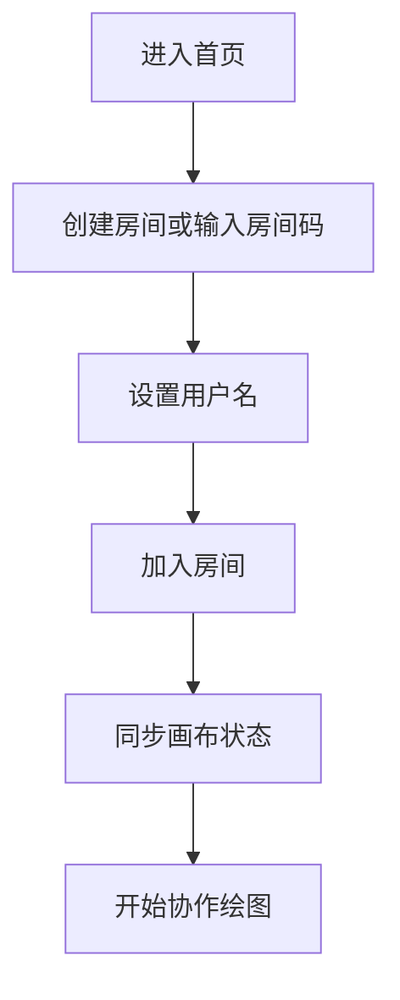
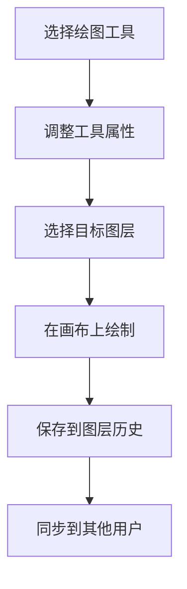

## 1. 产品概述

实时多人协作涂鸦白板是一款基于Web的在线协作绘图工具，支持多人通过房间码加入同一画布进行实时协作创作。解决远程团队头脑风暴、设计讨论、在线教学等场景下的协作需求。

- 核心价值：打破地域限制，实现多人实时协作绘图，提供专业的图层管理和丰富的绘图工具
- 目标用户：设计师、产品经理、教师、学生、远程团队

## 2. 核心特性

### 2.1 用户角色

| 角色 | 加入方式 | 核心权限 |
|------|---------|----------|
| 房主 | 创建房间 | 管理房间、控制跟随模式、管理图层 |
| 成员 | 输入房间码加入 | 绘制、编辑自己的图层、查看协作 |

### 2.2 功能模块

1. **画布主界面**：无限画布、绘图区域、视图缩放平移
2. **工具栏**：画笔、橡皮擦、直线、矩形、圆形、文字工具
3. **属性面板**：粗细调节、颜色选择、不透明度调节
4. **图层面板**：新建、删除、重命名、排序、可见性切换
5. **历史记录**：撤销、重做、每个图层独立历史
6. **协作系统**：房间创建/加入、实时同步、用户列表
7. **导入导出**：导入图片、导出PNG、导出PSD（模拟）
8. **跟随模式**：跟随房主视图位置

### 2.3 页面详情

| 页面名称 | 模块名称 | 功能描述 |
|---------|---------|----------|
| 登录/房间页 | 房间入口 | 创建房间、输入房间码加入、用户名设置 |
| 白板主界面 | 画布区域 | 无限画布、缩放平移、绘制显示 |
| 白板主界面 | 顶部工具栏 | 工具选择、撤销重做、导出导入、房间信息 |
| 白板主界面 | 左侧属性面板 | 工具属性调节（粗细、颜色、不透明度） |
| 白板主界面 | 右侧图层面板 | 图层列表、图层操作、可见性切换 |
| 白板主界面 | 底部状态栏 | 在线用户列表、房间码显示、跟随模式切换 |

## 3. 核心流程

### 用户加入房间流程

### 绘图操作流程

## 4. 用户界面设计

### 4.1 设计风格

**设计方向**：极简专业的创作工具风格，深色主题，强调内容沉浸感

- **主色调**：深灰 `#1a1a2e` 作为画布背景，深蓝 `#16213e` 作为面板背景
- **强调色**：紫罗兰 `#9d4edd` 作为选中和交互高亮
- **辅助色**：青色 `#00f5d4` 作为房主标识和成功状态
- **字体**：显示字体使用 Space Grotesk，正文使用 JetBrains Mono
- **布局**：三栏布局，左侧属性面板、中间画布、右侧图层面板
- **视觉层次**：毛玻璃面板、柔和阴影、微妙的渐变边框

### 4.2 页面设计概览

| 页面名称 | 模块名称 | UI元素 |
|---------|---------|--------|
| 房间入口页 | 卡片容器 | 玻璃拟态卡片、渐变边框、微动效输入框 |
| 白板主界面 | 画布区域 | 网格背景、无限滚动、缩放指示器 |
| 白板主界面 | 工具栏 | 图标按钮、选中状态高亮、悬停提示 |
| 白板主界面 | 属性面板 | 滑块控件、颜色选择器、数值输入 |
| 白板主界面 | 图层面板 | 可拖拽列表、缩略图预览、操作按钮组 |
| 白板主界面 | 用户列表 | 头像+名称、颜色标识、房主徽章 |

### 4.3 响应式设计

- 桌面端优先，三栏布局
- 平板端：折叠侧栏为可展开抽屉
- 移动端：竖向布局，画布占满屏幕，工具栏浮于底部

### 4.4 交互体验

- 画布平移拖拽有惯性效果
- 工具切换有平滑过渡动画
- 图层拖拽排序有位置预览
- 新用户加入有入场动画
- 同步操作有微妙的状态指示器
