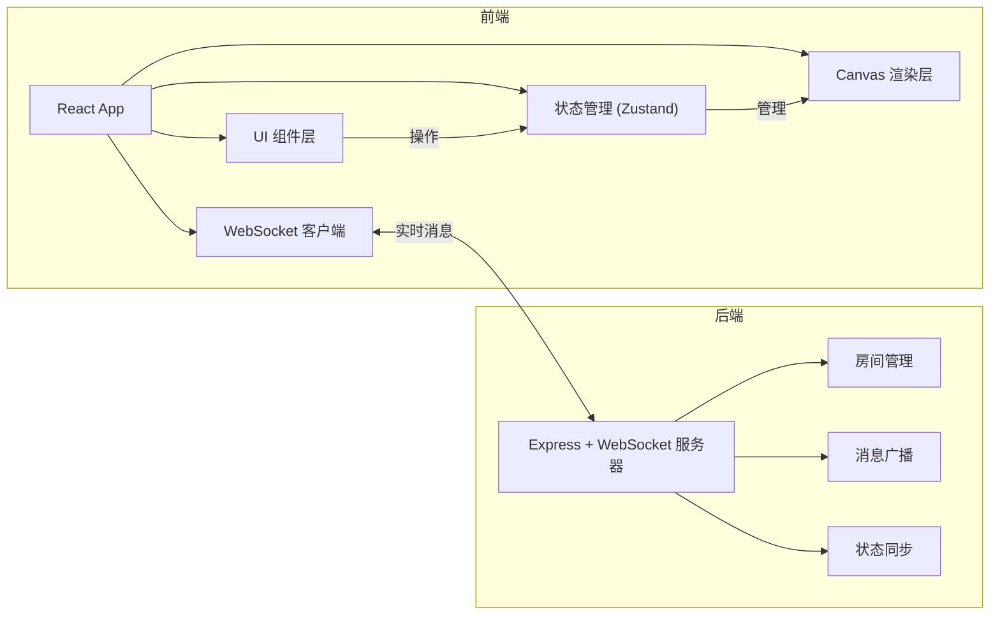
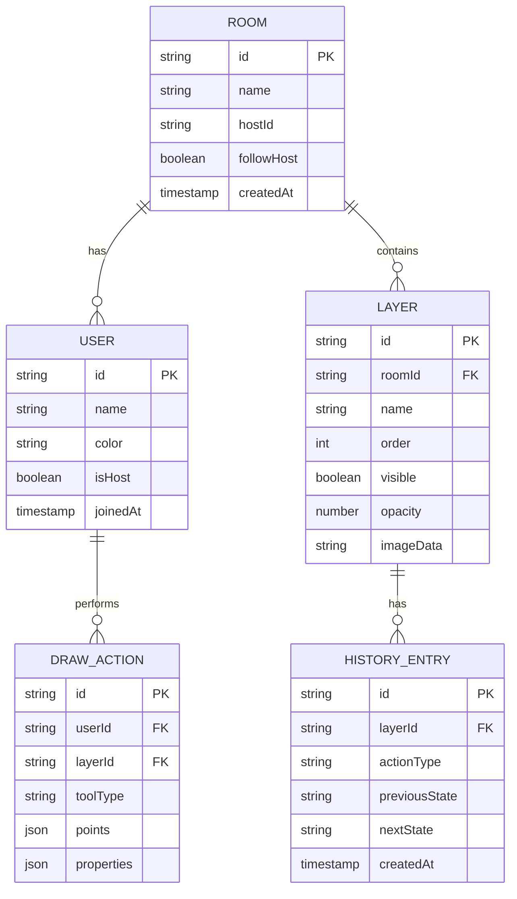
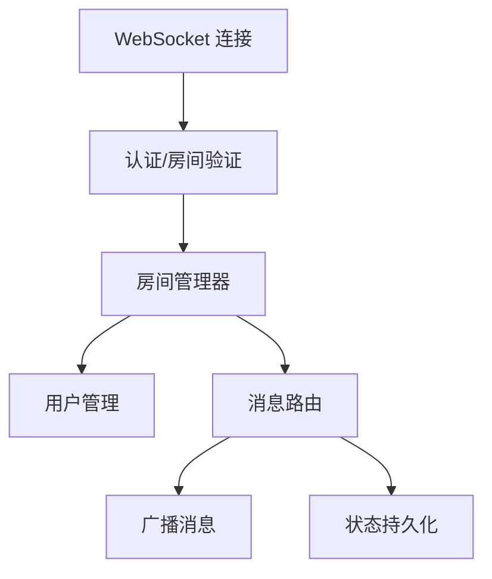

## 1. 架构设计



## 2. 技术选型

- **前端**：React@18 + TypeScript + Vite
- **样式**：TailwindCSS@3 + CSS 变量
- **状态管理**：Zustand
- **后端**：Express@4 + ws (WebSocket)
- **图标**：lucide-react
- **画布渲染**：原生 Canvas API
- **数据同步**：WebSocket 实时消息

## 3. 目录结构

```
├── src/
│   ├── components/       # React 组件
│   │   ├── canvas/       # 画布相关组件
│   │   ├── toolbar/      # 工具栏组件
│   │   ├── layers/       # 图层管理组件
│   │   ├── properties/   # 属性面板组件
│   │   ├── room/         # 房间相关组件
│   │   └── common/       # 通用组件
│   ├── hooks/            # 自定义 Hooks
│   │   ├── useCanvas.ts
│   │   ├── useDrawing.ts
│   │   ├── useWebSocket.ts
│   │   └── useHistory.ts
│   ├── store/            # Zustand Store
│   │   ├── useCanvasStore.ts
│   │   ├── useLayerStore.ts
│   │   ├── useToolStore.ts
│   │   └── useRoomStore.ts
│   ├── utils/            # 工具函数
│   │   ├── canvas.ts
│   │   ├── export.ts
│   │   └── sync.ts
│   ├── types/            # TypeScript 类型定义
│   ├── pages/            # 页面组件
│   └── App.tsx
├── api/                  # 后端代码
│   ├── server.ts
│   ├── roomManager.ts
│   └── types.ts
├── shared/               # 共享类型定义
└── package.json
```

## 4. API 定义

### WebSocket 消息类型

```typescript
// 基础消息结构
interface BaseMessage {
  type: string;
  roomId: string;
  userId: string;
  timestamp: number;
}

// 用户加入
interface JoinMessage extends BaseMessage {
  type: 'user:join';
  userName: string;
}

// 用户离开
interface LeaveMessage extends BaseMessage {
  type: 'user:leave';
}

// 绘图操作
interface DrawMessage extends BaseMessage {
  type: 'draw:action';
  layerId: string;
  toolType: string;
  points: Point[];
  properties: ToolProperties;
}

// 图层操作
interface LayerMessage extends BaseMessage {
  type: 'layer:create' | 'layer:delete' | 'layer:update' | 'layer:reorder';
  layerId: string;
  data: LayerData;
}

// 视图同步（跟随模式）
interface ViewMessage extends BaseMessage {
  type: 'view:update';
  offset: { x: number; y: number };
  zoom: number;
}

// 历史记录
interface HistoryMessage extends BaseMessage {
  type: 'history:undo' | 'history:redo';
  layerId: string;
}

// 全量同步
interface SyncMessage extends BaseMessage {
  type: 'sync:full';
  state: CanvasState;
}
```

## 5. 数据模型

### 5.1 核心数据结构



### 5.2 核心类型定义

```typescript
interface Point {
  x: number;
  y: number;
  pressure?: number;
}

interface ToolProperties {
  size: number;
  color: string;
  opacity: number;
  fill?: boolean;
  fontSize?: number;
  fontFamily?: string;
}

interface Layer {
  id: string;
  name: string;
  order: number;
  visible: boolean;
  opacity: number;
  canvas: HTMLCanvasElement | null;
  history: HistoryEntry[];
  historyIndex: number;
}

interface CanvasState {
  layers: Layer[];
  activeLayerId: string | null;
  offset: { x: number; y: number };
  zoom: number;
  users: User[];
}

interface User {
  id: string;
  name: string;
  color: string;
  isHost: boolean;
}
```

## 6. 服务器架构



### 服务器模块

- **server.ts**：Express + WebSocket 服务器入口
- **roomManager.ts**：房间创建、管理、状态维护
- **messageHandler.ts**：消息解析和路由
- **broadcast.ts**：消息广播机制
